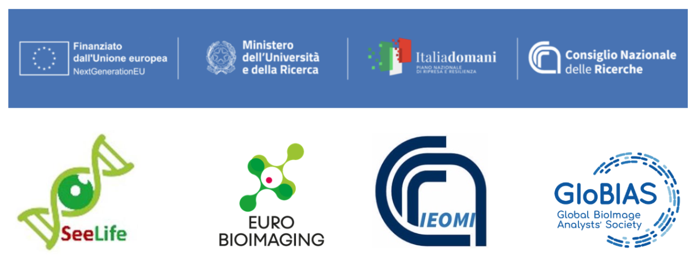

<style>
/* Sticky Navigation Bar */
.navbar {
  position: sticky;
  top: 0;
  background: linear-gradient(135deg, #2c3e50, #34495e);
  padding: 10px 0;
  z-index: 1000;
  box-shadow: 0 2px 10px rgba(0,0,0,0.3);
  border-bottom: 3px solid #3498db;
}

.nav-container {
  max-width: 1200px;
  margin: 0 auto;
  display: flex;
  justify-content: space-between;
  align-items: center;
  padding: 0 20px;
}

.nav-logo {
  color: #ecf0f1;
  font-size: 1.2rem;
  font-weight: bold;
  text-decoration: none;
}

.nav-menu {
  display: flex;
  list-style: none;
  margin: 0;
  padding: 0;
  gap: 30px;
}

.nav-item {
  margin: 0;
}

.nav-link {
  color: #ecf0f1;
  text-decoration: none;
  padding: 8px 15px;
  border-radius: 5px;
  transition: all 0.3s ease;
  font-size: 0.9rem;
}

.nav-link:hover {
  background: #3498db;
  color: white;
  text-decoration: none;
}

/* Mobile Menu Toggle */
.mobile-menu-toggle {
  display: none;
  background: none;
  border: none;
  color: #ecf0f1;
  font-size: 1.5rem;
  cursor: pointer;
}

/* Mobile Responsive */
@media (max-width: 768px) {
  .nav-menu {
    position: fixed;
    top: 60px;
    left: -100%;
    width: 100%;
    height: calc(100vh - 60px);
    background: linear-gradient(135deg, #2c3e50, #34495e);
    flex-direction: column;
    justify-content: flex-start;
    align-items: center;
    padding-top: 50px;
    transition: left 0.3s ease;
    gap: 20px;
  }
  
  .nav-menu.active {
    left: 0;
  }
  
  .mobile-menu-toggle {
    display: block;
  }
  
  .nav-link {
    font-size: 1.1rem;
    padding: 15px 30px;
    width: 200px;
    text-align: center;
  }
  
  .navbar {
    padding: 15px 0;
  }
}

/* Adjust main content to account for fixed navbar */
body {
  padding-top: 0;
}

/* Workshop date highlight */
.workshop-date {
  background: linear-gradient(45deg, #e74c3c, #c0392b);
  color: white;
  padding: 15px;
  border-radius: 8px;
  text-align: center;
  margin: 20px 0;
  border-left: 5px solid #c0392b;
}

/* Important notice styling */
.important-notice {
  background: linear-gradient(45deg, #f39c12, #e67e22);
  color: white;
  padding: 15px;
  border-radius: 8px;
  margin: 20px 0;
  border-left: 5px solid #d35400;
}

/* Scroll to Top Button */
#scrollToTop {
  display: none;
  position: fixed;
  bottom: 20px;
  right: 20px;
  z-index: 99;
  border: none;
  outline: none;
  background: linear-gradient(45deg, #3498db, #2980b9);
  color: white;
  cursor: pointer;
  padding: 15px;
  border-radius: 50%;
  font-size: 18px;
  box-shadow: 0 4px 15px rgba(52, 152, 219, 0.3);
  transition: all 0.3s ease;
}
</style>

<!-- Sticky Navigation Bar -->
<nav class="navbar">
  <div class="nav-container">
    <a href="#fluorescence-image-analysis-workshop" class="nav-logo">🔬 CNR Workshop 2025</a>
    
    <button class="mobile-menu-toggle" onclick="toggleMobileMenu()">☰</button>
    
    <ul class="nav-menu" id="navMenu">
      <li class="nav-item"><a href="#learning-outcomes" class="nav-link">📚 Learning</a></li>
      <li class="nav-item"><a href="#programme" class="nav-link">📅 Programme</a></li>
      <li class="nav-item"><a href="#installation-requirements" class="nav-link">💻 Installation</a></li>
      <li class="nav-item"><a href="#detailed-installation-instructions" class="nav-link">🔧 Setup Guide</a></li>
      <li class="nav-item"><a href="#troubleshooting" class="nav-link">🆘 Help</a></li>
    </ul>
  </div>
</nav>

<button id="scrollToTop" onclick="scrollToTop()" title="Go to top">⬆️</button>

<script>
function toggleMobileMenu() {
  const navMenu = document.getElementById('navMenu');
  navMenu.classList.toggle('active');
}

// Initialize when page loads
document.addEventListener('DOMContentLoaded', function() {
  // Close mobile menu when clicking on a link
  document.querySelectorAll('.nav-link').forEach(link => {
    link.addEventListener('click', () => {
      document.getElementById('navMenu').classList.remove('active');
    });
  });

  // Smooth scrolling for navigation links
  document.querySelectorAll('a[href^="#"]').forEach(anchor => {
    anchor.addEventListener('click', function (e) {
      e.preventDefault();
      const target = document.querySelector(this.getAttribute('href'));
      if (target) {
        target.scrollIntoView({
          behavior: 'smooth',
          block: 'start'
        });
      }
    });
  });
});

// Scroll to top functionality
function scrollToTop() {
  window.scrollTo({
    top: 0,
    behavior: 'smooth'
  });
}

// Show/hide scroll to top button
window.addEventListener('scroll', function() {
  const scrollBtn = document.getElementById('scrollToTop');
  if (window.pageYOffset > 300) {
    scrollBtn.style.display = 'block';
  } else {
    scrollBtn.style.display = 'none';
  }
});
</script>

<p align="center">
  


</p>

# Fluorescence image analysis workshop
**Introduction to BioImage Analysis for Microscopy - GloBIAS & CNR Naples 2025**

<div class="workshop-date">
  📅 <strong>7-11 July 2025</strong><br>
  📍 Consiglio Nazionale delle Ricerche (CNR)<br>
  Istituto degli endotipi, in oncologia, metabolismo e immunologia (IEOMI)<br>
  "G. SALVATORE" - Naples (Italy)
</div>

**Local organizers:**  
Domenico Russo, Simone Di Paola, Seetharaman Parashuraman (CNR, Naples)

 This training is developed and delivered by <a href="https://github.com/RoccoDAnt">Rocco D’Antuono</a> (The Francis Crick Institute, London, UK), <a href="https://github.com/StojiljkovicVetAna">Ana Stojiljkovic</a> (University of Bern, Switzerland), <a href="https://github.com/sebgoti">Sebastian Gonzalez Tirado</a> (Heidelberg University, Germany), <a href="https://github.com/Daniel-Waiger">Daniel Waiger</a> (Hebrew University of Jerusalem, Rehovot, Israel).

## Table of Contents
- [Learning Outcomes](#learning-outcomes)
- [Programme](#programme)  
- [Installation Requirements](#installation-requirements)
- [Troubleshooting](#troubleshooting)

## Learning Outcomes
At the end of the course, trainees will be able to:
- Describe the basic concepts of fluorescence image formation and bioimage analysis
- Quantify shape and fluorescence intensity of cells and organelles
- Measure colocalization and spatial relationships between classes of objects
- Track objects in 3D and render image datasets in 3D for animations
- Run basic 3D segmentation and create plots to show results
- Prepare figures for scientific publications

The course will include talks, practical sessions, and project work on trainees' own data or test datasets from public image databases.

<br>

## Programme:
### Day 1
Monday 7th July 2025
#### Introduction & Basics of Image Analysis

|<b>Time</b>| <b>Topic</b>|
|---| ---|
|08:30-09:00| Introduction to the course - Domenico Russo, Simone Di Paola, Seetharaman Parashuraman|
|09:00-09:30| Participants self introduction - All Trainers and Trainees|
|09:30-10:30| Image formation in fluorescence microscopy - Rocco D'Antuono|
|10:30-11:00| Coffee break|
|11:00-12:00| Introduction to bioimage analysis - Rocco D'Antuono|
|12:00-13:00| Lunch |
|13:00-14:00| Introduction to FIJI - Daniel Waiger|
|14:00-15:00| Showcase of FIJI plugins for bioimage analysis - All trainers|
|15:00-15:30| Coffee break|
|15:30-16:30| ilastik for interactive segmentation - Daniel Waiger|
|16:30-17:30| Project working groups with own data or test data - Ana Stojiljkovic and Rocco D'Antuono|


### Day 2
Tuesday 8th July 2025
#### Advanced Image Processing

|<b>Time</b>| <b>Topic</b>|
|---| ---|
|09:00-09:30| Progress check on project work and trainees' expectations|
|09:30-10:00| Introduction to ImageJ macro language - Ana Stojiljkovic |
|10:00-10:30| Automatisation of bioimage analysis with ImageJ macro powered by large language models- Daniel Waiger |
|10:30-11:00| Coffee break|
|11:00-12:00| ImageJ macro practical session - Ana Stojiljkovic and Daniel Waiger|
|12:00-13:00| Lunch |
|13:00-14:00| TrackMate for cell and organelle tracking - Sebastian Gonzalez Tirado|
|14:00-15:00| Tracking hands-on session - Sebastian Gonzalez Tirado and Rocco D'Antuono|
|15:00-15:30| Coffee break|
|15:30-17:00| Project working groups with own data or test data - Daniel Waiger and Sebastian Gonzalez Tirado|
|17:00-17:30| Progress report on project work - How to do better? - All the trainers|


### Day 3
Wednesday 9th July 2025
#### Batch analysis of large data sets

|<b>Time</b>| <b>Topic</b>|
|---| ---|
|09:00-09:30| Progress check on project work and trainees' expectations|
|09:30-10:30| CellProfiler pipelines for the analysis of HCS data - Ana Stojiljkovic |
|10:30-11:00| Coffee break|
|11:00-12:00| CellProfiler practical session - Ana Stojiljkovic and Rocco D'Antuono|
|12:00-13:00| Lunch |
|13:00-14:00| CellProfiler Analyst to visualise and plot image analysis results - Rocco D'Antuono and Ana Stojiljkovic|
|14:00-15:00| Build your own CellProfiler pipeline - hands-on session - Ana Stojiljkovic and Rocco D'Antuono|
|15:00-15:30| Coffee break|
|15:30-17:00| Project working groups with own data or test data - Rocco D'Antuono and Ana Stojiljkovic|
|17:00-18:00| Progress report on project work - How to do better? - All the trainers|


### Day 4
Thursday 10th July 2025
#### 3D Segmentation and figure preparation

|<b>Time</b>| <b>Topic</b>|
|---| ---|
|09:00-09:30| Progress check on project work and trainees expectations|
|09:30-10:30| napari for 3D rendering and segmentation - Rocco D'Antuono and Sebastian Gonzalez Tirado|
|10:30-11:00| Coffee break|
|11:00-12:00| napari for 3D segmentation - practical session - Sebastian Gonzalez Tirado and Rocco D'Antuono|
|12:00-13:00| Lunch |
|13:00-14:00| Figure preparation with FIJI and Inkscape - Rocco D'Antuono|
|14:00-15:00| Project working groups with own data or test data - Sebastian Gonzalez Tirado and Ana Stojiljkovic|
|15:00-15:30| Coffee break|
|15:30-16:00| Project working - Conclusions - All the Trainers|
|16:00-17:00| Trainees presentation on own project work |
|17:00-17:30| Wrap up on the use of open-source for bioimage analysis- All the trainers|


### Day 5
Friday 11th July 2025
#### Introduction to ZEISS arivis Advanced Image Analysis

|<b>Time</b>| <b>Topic</b>|
|---| ---|
|09:00-10:30| Part 1|
|10:30-11:00| Coffee break|
|11:00-12:00| Part 2|
|12:00-13:00| Lunch |
|13:00-15:00| Part 3|
|15:00-15:30| Coffee break|
|15:30-17:00| Part 4|


--------------------------
# Preparation for the course
## Installation Requirements

<div class="important-notice">
  ⚠️ <strong>Important:</strong> Please complete all software installations before the workshop begins. We'll have limited time for troubleshooting during sessions.
</div>

### Prerequisites
- **Hardware**: Minimum 10-15 GB free disk space
- **Operating System**: Windows, macOS, or Linux

### Software Installation by Day

#### Required for Day 1-2: Basic Image Analysis
- [ ] **FIJI**: Download from [https://fiji.sc/](https://fiji.sc/)
- [ ] **ilastik**: Download from [https://www.ilastik.org/download](https://www.ilastik.org/download)

#### Required for Day 3: Batch Analysis
- [ ] **CellProfiler**: Download from [https://cellprofiler.org/](https://cellprofiler.org/)
- [ ] **CellProfiler Analyst**: Download from [https://cellprofileranalyst.org/](https://cellprofileranalyst.org/)

#### Required for Day 4: 3D Analysis & Figures
- [ ] **Anaconda Navigator**: [Installation guide](#anaconda-installation)
- [ ] **napari**: [Installation guide](#napari-installation)
- [ ] **Inkscape**: Download from [https://inkscape.org/](https://inkscape.org/)

---

## Detailed Installation Instructions


### Day 1
Two software needed: FIJI and ilastik. Trainees need to
1. Download FIJI from [https://fiji.sc/](https://fiji.sc/), selecting your operating system, and extract the .zip folder. The software is ready for use.

2. Download and install ilastik from [https://www.ilastik.org/](https://www.ilastik.org/download#stable:~:text=tracking%20with%20learning.-,Regular%20builds,-Windows%20(64%2Dbit)), selecting your operative system.


### Day 2
The hands-on session will rely on the use of FIJI and ilastik (installed on Day 1).


### Day 3
Two software needed: CellProfiler and CellProfiler Analyst. Trainees need to
1. Download and install CellProfiler from [https://cellprofiler.org/](https://cellprofiler.org/), selecting your operating system.

2. Download and install CellProfiler Analyst from [https://cellprofileranalyst.org/](https://cellprofileranalyst.org/).


### Day 4
Two software needed: Inkscape for figure preparation and napari.

1. Download and install Inkscape from [inkscape.org](https://inkscape.org/release/inkscape-1.4.2/) 

2. Install napari

During the hands-on sessions we will extensively try and retry the software installation with conda environments, however to gain some practice and proceed smoothly to more interesting topics, please proceed with the following homework before the workshop

#### 1. Install Anaconda Navigator
#### 2. Install napari within conda prompt

Please make sure to have at least 10-15 GB free on the pc you will bring with you for participating in the workshop. Please let us know well in advance if you cannot bring a pc with you, we might be able to get a loan, however this is not guaranteed and you might risk to have no pc to follow along.

#### 1. Install Anaconda Navigator
This is a method that use the graphical user interface to download and install Anaconda Navigator.
Please visit https://docs.anaconda.com/ and click on the green button "Download Anaconda". You will be asked to provide an email address and will receive the link to the download page, where you will choose the version for your OS.

Before installing Anaconda Navigator, please identify a folder in your computer over which you have full permission of read and write file: we will create and update many times conda environments, this means that the software will install and remove files all the times.

#### 2. Install napari within conda prompt
The successful installation of Anaconda Navigator will make available an app called "Anaconda prompt". This is the terminal that we will use to create and work with conda environments.

**Step 1: Update conda**
```bash
conda update -n base -c conda-forge conda
```

**Step 2: Create environment** (replace `workshop-env` with your preferred name)
```bash
conda create -n workshop-env python=3.12
```

**Step 3: Activate environment**
```bash
conda activate workshop-env
```
You should notice a change in the prompt where the name "base" at the beginning of the prompt has been changed to "workshop-env". This confirms that it is safe to install new packages, as you are not altering the base environment (safe choice is not to touch "base").

**Step 4: Install napari**
```bash
conda install -c conda-forge napari pyqt
```

**Step 5: Test installation**
At this point, if no error appears in the terminal as result of the operations above, you are ready to open napari executing:
```bash
napari
```
##### Create a conda environment with a recipe
If a working environment cannot be created through the commands above, the following recipe can be used to create an environment with napari

a) Download the file [cbias2024-napari-env.yml](https://github.com/FrancisCrickInstitute/CBIAS_napari_workshop_2024/tree/main/envs/cbias2024-napari-env.yml) into a local folder

b) use the Anaconda prompt to navigate to the local folder and execute
```
conda env create -f cbias2024-napari-env.yml
```
This should create an environment with the same name of the .yml file unless otherwise specified.

c) check that napari opens

At this point, if no error appears in the terminal as result of the operations above, you are ready to open napari executing
```
napari
```

## Troubleshooting

### Common Issues

- **napari won't start**: Ensure you've activated the correct conda environment
- **Installation fails**: Check you have sufficient disk space (10-15 GB required)
- **Conda environment conflicts**: Use a unique environment name like `workshop-2025-env`
- **Can't bring laptop**: Contact organizers at least 1 week before the workshop

### Getting Help

If you encounter issues during installation:
1. Check the software documentation links above
2. Contact the workshop organizers for technical support
3. Join early for Day 1 - we'll have limited time for installation troubleshooting

### Contact Information

- **Technical questions**: Contact workshop trainers via [GitHub issues](https://github.com/your-repo/issues)
- **Workshop logistics**: Contact local organizers - Domenico Russo, Simone Di Paola, Seetharaman Parashuraman

---

*📧 For questions about this workshop, please contact the local organizers or open an issue in this repository.*

*🌟 This website is powered by GitHub Pages with a custom responsive navigation system.*
